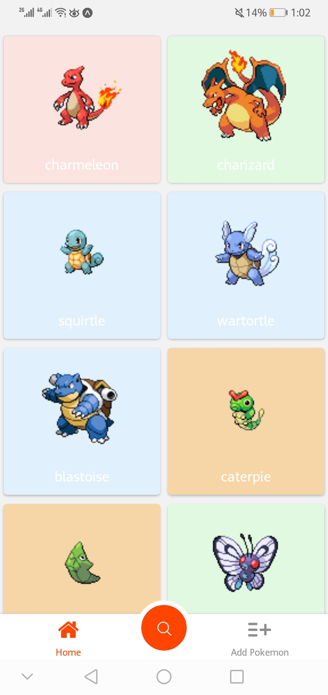
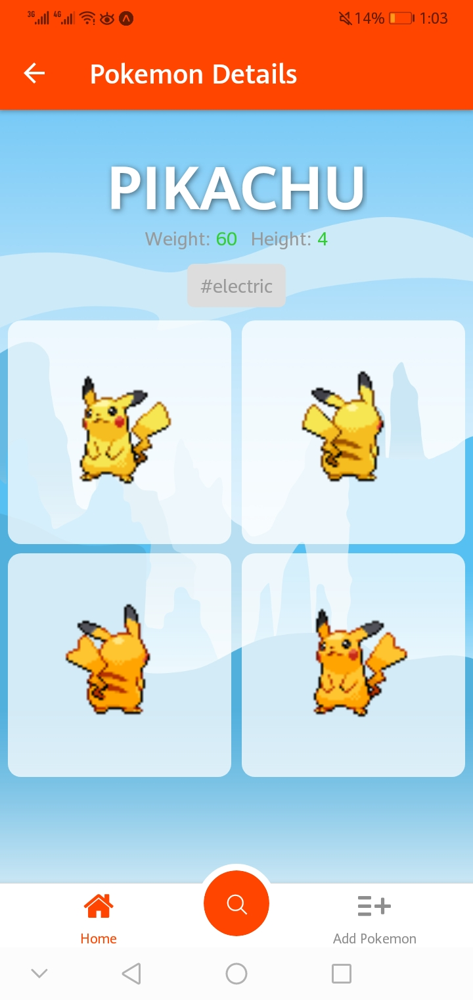
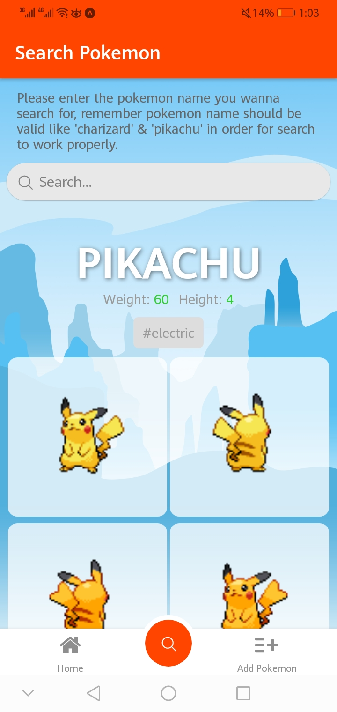
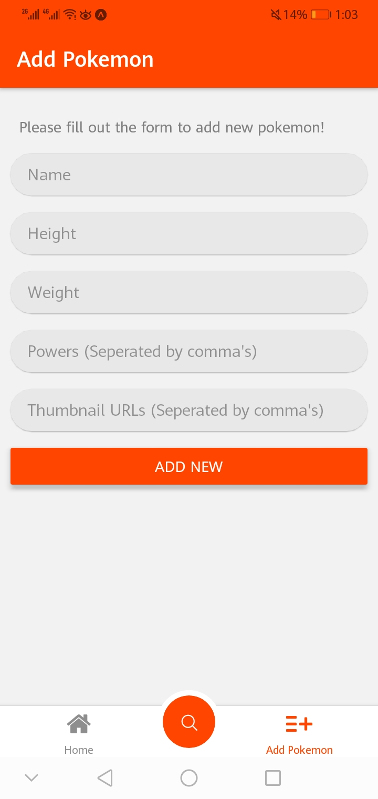
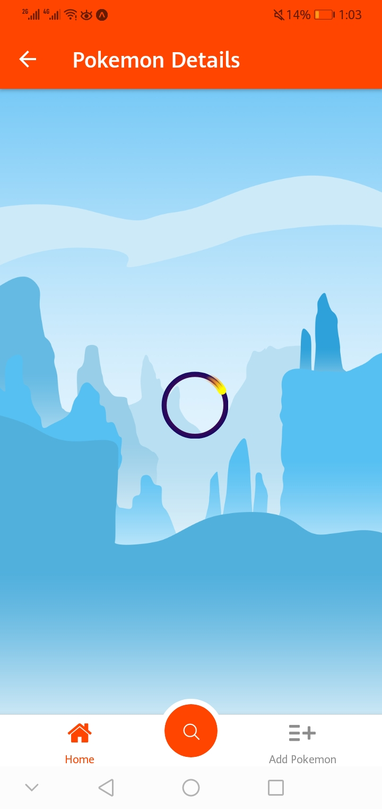

# Native Android & IOS Application Build with Expo and React Native

# Setting up

> First make sure you have ``Expo``, ``Node.js`` and ``npm`` installed globally in your system.
After that follow the below steps to get pokemon app up and running!

### [ STEP 1 ] clone the project
```bash
git clone https://github.com/junaid-home/react-native-pokemon.git <name>
```
### [ STEP 2 ] navigate to the project directory and install dependencies
```bash
cd <name>
npm install
```
### [ STEP 3 ] start development 
```bash
expo start
```

## Project Screenshots
<center>







</center>
